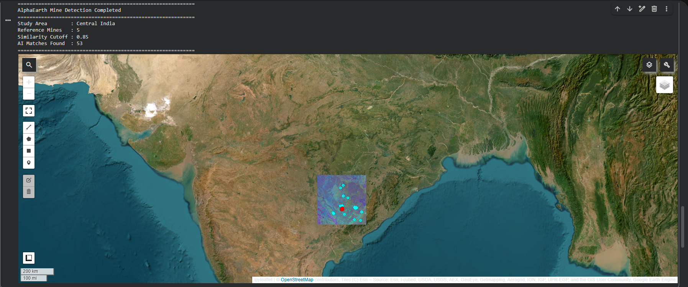
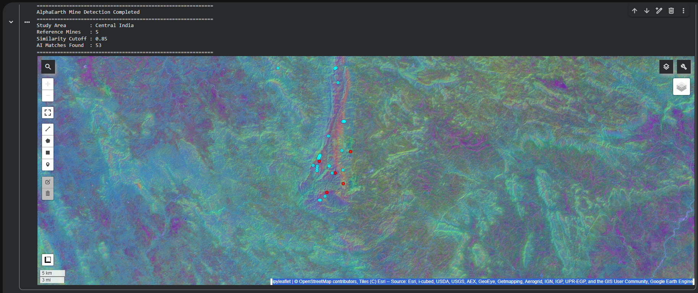
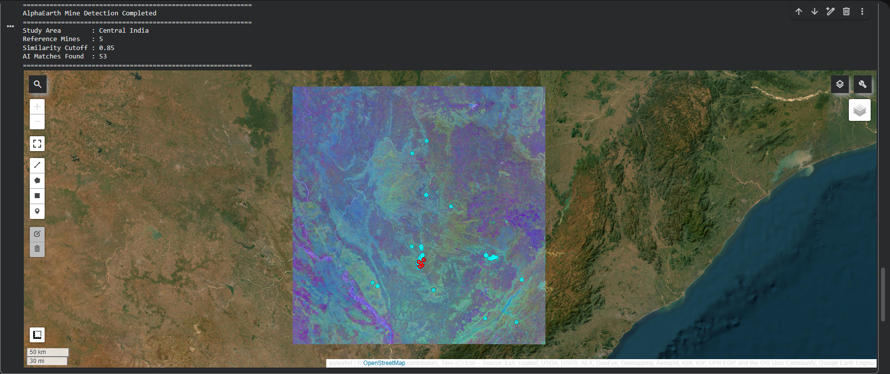

# AI-Powered Iron Ore Mine Detection using Google DeepMind AlphaEarth Foundation

An AI-powered geospatial similarity search project that leverages **Google DeepMind's AlphaEarth Foundation**, **Google Earth Engine**, and **Python** to identify potential iron ore mining locations from satellite imagery using foundation model embeddings.

---

## Project Overview

This project demonstrates how modern geospatial foundation models can be applied to mineral exploration without training a custom machine learning model.

Using Google's **AlphaEarth Satellite Embedding (V1 Annual)** dataset, the workflow compares known iron ore mine locations with surrounding landscapes by measuring embedding similarity. Locations exhibiting similar spectral and spatial characteristics are automatically identified as candidate iron ore mining areas.

The project showcases the practical application of AI-powered remote sensing for large-scale mineral exploration and geospatial intelligence.

---

## Key Features

- AI-powered similarity search using AlphaEarth Foundation embeddings
- Google Earth Engine cloud-based geospatial processing
- Interactive visualization using Geemap
- Automatic candidate mine location detection
- Foundation Model based remote sensing workflow
- No supervised model training required
- Fully reproducible Python notebook

---

## Technologies Used

| Category | Technology |
|-----------|------------|
| Programming | Python |
| Cloud Platform | Google Earth Engine |
| AI Foundation Model | Google DeepMind AlphaEarth Foundation |
| Geospatial Library | Geemap |
| Remote Sensing | Satellite Embeddings |
| Mapping | Interactive Web Maps |
| Visualization | Leaflet / Geemap |

---

## Study Area

**Region:** Central India

The project investigates a selected region containing known iron ore mines and searches for additional locations exhibiting similar geospatial signatures.

---

## Methodology

### Step 1
Authenticate and initialize Google Earth Engine.

### Step 2
Define the Area of Interest (AOI).

### Step 3
Select known iron ore mine locations as reference points.

### Step 4
Load the Google DeepMind AlphaEarth Satellite Embedding dataset.

### Step 5
Extract embedding vectors from each reference mine.

### Step 6
Compute cosine similarity between every pixel and the reference embeddings.

### Step 7
Apply a similarity threshold to identify potential candidate locations.

### Step 8
Visualize the detected locations using an interactive web map.

---

## Workflow

```
Known Mine Locations
          │
          ▼
AlphaEarth Satellite Embeddings
          │
          ▼
Embedding Extraction
          │
          ▼
Cosine Similarity Analysis
          │
          ▼
Similarity Thresholding
          │
          ▼
Candidate Mine Detection
          │
          ▼
Interactive Map Visualization
```

---

## Project Results

| Parameter | Value |
|------------|-------|
| Study Area | Central India |
| Reference Mine Locations | 5 |
| Similarity Threshold | 0.85 |
| AI Detected Candidate Locations | 53 |

---

## Repository Structure

```
AI-Powered-Iron-Ore-Mine-Detection
│
├── REMOTE_SENSING_PROJECT.ipynb
├── Central_India_Mine_Detection.html
├── overview_map.png
├── candidate_mine_locations.png
├── similarity_visualization.png
└── README.md
```

---

## Interactive Map

The repository includes an interactive HTML map generated using **Geemap**.

Open

```
Central_India_Mine_Detection.html
```

in any modern web browser to explore the AI-generated detection results interactively.

---

# Screenshots

## Project Overview



*Figure 1. Overview of the study area showing AlphaEarth embeddings, reference mine locations (red), and AI-detected candidate locations (cyan).*

---

## AI Detected Candidate Mine Locations



*Figure 2. Zoomed visualization of the candidate iron ore mining locations detected through AlphaEarth embedding similarity.*

---

## AlphaEarth Similarity Visualization



*Figure 3. High-resolution AlphaEarth embedding visualization used for similarity analysis.*

---

## Skills Demonstrated

- Artificial Intelligence for Earth Observation
- Remote Sensing
- Google Earth Engine
- Python Programming
- Geospatial Data Analysis
- Geospatial AI
- Satellite Image Processing
- Foundation Models
- GIS Visualization
- Interactive Mapping
- Spatial Similarity Analysis

---

## Applications

- Mineral Exploration
- Geological Mapping
- Remote Sensing
- AI-assisted Earth Observation
- GIS Analysis
- Environmental Monitoring
- Spatial Decision Support

---

## Future Scope

- Automatic threshold optimization
- Multi-mineral exploration
- Sentinel-2 integration
- Geological layer integration
- Lineament and lithology fusion
- Deep learning assisted validation
- WebGIS dashboard deployment
- GeoJSON and Shapefile export
- Large-scale regional mineral prospectivity mapping

---

## Author

**Dibya Jyoti Das**

M.Sc. Applied Geology

Department of Earth Sciences

Sambalpur University

---

## Acknowledgements

- Google DeepMind
- Google Earth Engine
- AlphaEarth Foundation
- Geemap Python Library
- OpenStreetMap Contributors

---

## References

Brown et al. (2025). **AlphaEarth Foundations: An Embedding Field Model for Accurate and Efficient Global Mapping from Sparse Label Data.**

Google Earth Engine Documentation

Google DeepMind AlphaEarth Foundation Dataset
